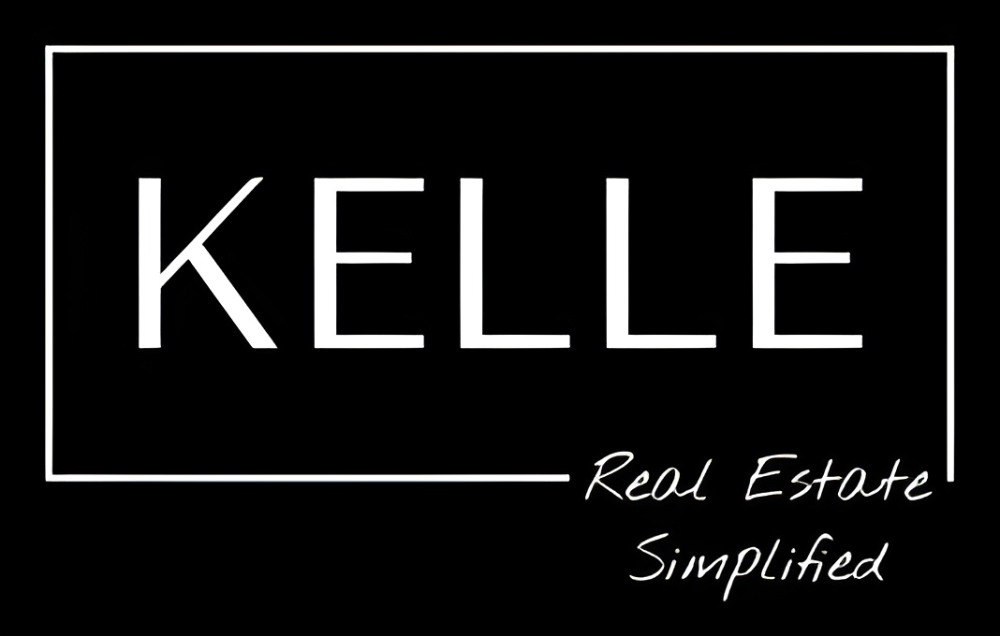
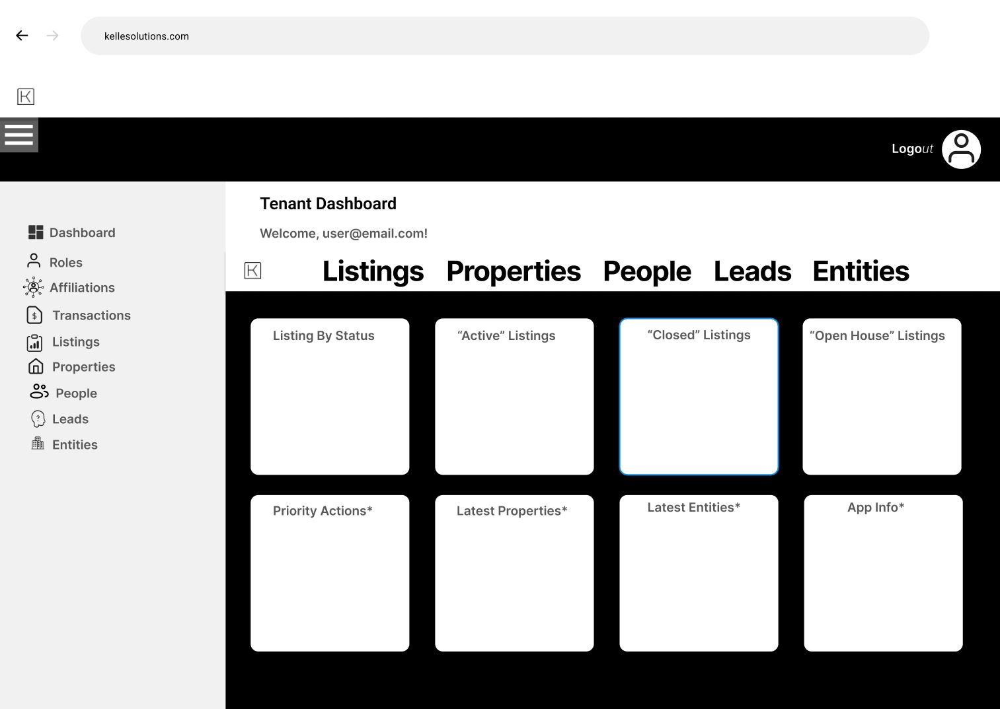
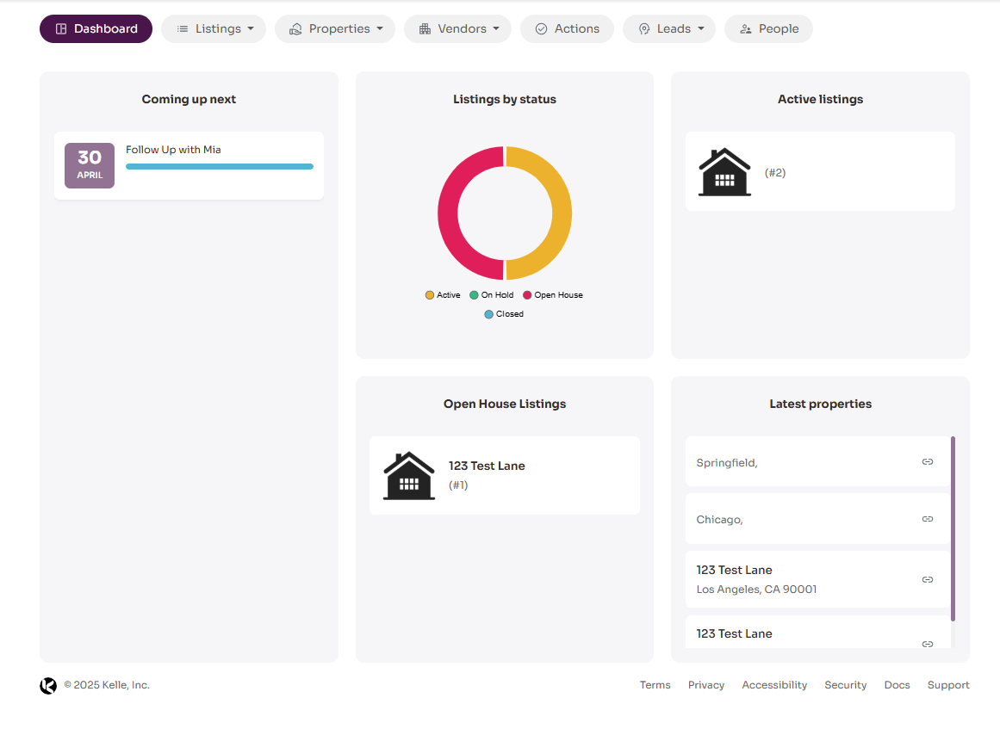
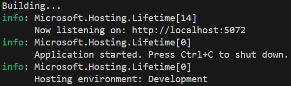

<p align="center">
  

# Kelle Solutions
Kelle Solutions is a simple Razor Pages web application built with ASP.NET Core and Entity Framework Core. Our application demonstrates basic CRUD (Create, Read, Update, Delete) functionality using a database (SQL Server).

| Mockup Dashboard | Current Working Dashboard |
|--------------------------|--------------------------|
|    |    |

## Synopsis
Kelle Solutions is a user-friendly, multi-tenant SaaS (Software as a Service) platform designed to streamline operations for real estate professionals. It provides an all-in-one solution for users to organize and manage their businesses effectively. Each role (agent, tenant, and admin) has tailored views and specific permissions to CRUD (Create, Read, Update, Delete) functionalities. With a scalable design, Kelle Solutions integrates seamlessly with essential tools and systems, allowing users to navigate through their dashboard, leads, properties, listings, entities, and people. While agents have limited access to most functionalities, tenants and admins have additional tools and features with tenants having advanced permissions.

<h2>
  <picture>
  <source media="(prefers-color-scheme: dark)" srcset="images/TOCicon.png">
  <source media="(prefers-color-scheme: light)" srcset="images/TOCiconlight.png">
  
  </picture>
  Table of Contents
</h2>

- [Team Scrumbags Members](#team-scrumbags-members)
- [Features](#features)
- [Prerequisites](#prerequisites)
- [Getting Started](#getting-started)
- [Project Structure](#project-structure)
- [Timeline](#timeline)
- [Technologies Used](#technologies-used)
- [How to Contribute](#how-to-contribute)
- [License](#license)

<h2 id="team-scrumbags-members">
  <picture>
  <source media="(prefers-color-scheme: dark)" srcset="images/membersicon.png">
  <source media="(prefers-color-scheme: light)" srcset="images/membersiconlight.png">
  
  </picture>
  Team Scrumbags Members
</h2>

| Members               |
|-----------------------|
| Nancy Zhu             |
| Steven Cao            |
| Brandon Kmiec         |
| Evan Brizendine       |
| Jalen Grant Hall      |
| Kestine Tran          |
| Kyle Mucha            |
| Sergio Rodriguez [Team Lead]|

<h2 id="features">
  <picture>
  <source media="(prefers-color-scheme: dark)" srcset="images/features.png">
  <source media="(prefers-color-scheme: light)" srcset="images/featureslight.png">
  
  </picture>
  Features
</h2>

- Razor Pages with ASP.NET Core
- Entity Framework Core for data access
- SQL Server database for persistence
- Dependency Injection for `DbContext`
- CRUD operations for managing student data


<h2 id="prerequisites">
  <picture>
  <source media="(prefers-color-scheme: dark)" srcset="images/prerequisites.png">
  <source media="(prefers-color-scheme: light)" srcset="images/prerequisiteslight.png">
  
  </picture>
  Prerequisites
</h2>

Before running the application, ensure you have the following installed:

- [.NET 6.0 SDK](https://dotnet.microsoft.com/download)
- [SQL Server](https://www.microsoft.com/en-us/sql-server/sql-server-downloads) or [LocalDB](https://docs.microsoft.com/en-us/sql/database-engine/configure-windows/sql-server-2016-express-localdb)
- A text editor or an IDE like [Visual Studio](https://visualstudio.microsoft.com/) or [VS Code](https://code.visualstudio.com/)

<h2 id="getting-started">
  <picture>
  <source media="(prefers-color-scheme: dark)" srcset="images/gettingstarted.png">
  <source media="(prefers-color-scheme: light)" srcset="images/gettingstartedlight.png">
  
  </picture>
  Getting Started
</h2>

Follow these steps to get the application up and running:

### 1. Clone the Repository

```bash
git clone https://github.com/kestra13/kelle-solutions.git
cd kelle-solutions
```

### 2. Restore and Build the Project
```
dotnet tool install --global dotnet-ef
dotnet restore
dotnet build
```

### 3. Install Dependencies (if necessary!)

Install the required NuGet packages if they are not installed:

```bash
dotnet add package Microsoft.EntityFrameworkCore.SqlServer
dotnet add package Microsoft.EntityFrameworkCore.Design
```

### 4. Set Up the Database Connection

Update the `appsettings.json` file with your database connection settings. Here is the recommended setup:

```
{
  "ConnectionStrings": {
    "DefaultConnection": "Server=(localdb)\\mssqllocaldb;Database=SchoolDB;Trusted_Connection=True;MultipleActiveResultSets=true"
  },
  "Logging": {
    "LogLevel": {
      "Default": "Information",
      "Microsoft.AspNetCore": "Warning"
    }
  },
  "AllowedHosts": "*"
}

```

### 5. Apply Migrations and Create the Database

Use Enitity Framework Core to apply migrations and create the database schema:

```bash
dotnet ef migrations add InitialCreate
dotnet ef database update
```

### 6. Run the Application

Use the following command to run the application locally:

```bash
dotnet run
```

The application will start on `https://localhost:5072` or `http://localhost:5000`. Upon running the application, the terminal should list the address!



<h2 id="project-structure">
  <picture>
  <source media="(prefers-color-scheme: dark)" srcset="images/structure.png">
  <source media="(prefers-color-scheme: light)" srcset="images/structurelight.png">
  
  </picture>
  Project Structure
</h2>

| **Path**                       | **Description**                                                                                  |
|--------------------------------|--------------------------------------------------------------------------------------------------|
| `Pages/Affiliations`           | Razor Pages for reading, updating, and deleting a User's company or organization affiliation.    |
| `Pages/Entities`               | Razor Pages for creating, reading, updating, and deleting entities, which represent companies and organizations. |
| `Pages/Leads`                  | Razor Pages for creating, reading, updating, and deleting leads, which are potential tenants or clients. |
| `Pages/Listings`               | Razor Pages for creating, reading, updating, and deleting property listings, which are advertisements for houses. |
| `Pages/People`                 | Razor Pages for creating, reading, updating, and deleting tenants, or clients.                  |
| `Pages/Properties`             | Razor Pages for creating, reading, updating, and deleting properties.                           |
| `Pages/Roles`                  | Razor Pages for reading table of User roles.                                                    |
| `Pages/Shared`                 | Razor Pages for general UI/UX layout and login recognition.                                     |
| `Pages/Transactions`           | Razor Pages for documenting transactions.                                                       |
| `Models/Affiliate.cs`          | The `Affiliate` entity class, representing an agent's company or organization.                  |
| `Models/Person.cs`             | The `Person` entity class, representing tenants, or clients.                                    |
| `Models/RealEstateProperty.cs` | The `RealEstateProperty` entity class, representing a property.                                 |
| `Models/User.cs`               | The `User` entity class, representing any agent, tenant, or admin who logs in.                  |
| `Data/KelleSolutionsDbContext.cs` | The database context class for managing the database connection and querying the `Properties` and `Affiliates` model. |

<h2 id="timeline">
  <picture>
  <source media="(prefers-color-scheme: dark)" srcset="images/timeline.png">
  <source media="(prefers-color-scheme: light)" srcset="images/timelinelight.png">
  
  </picture>
  Timeline
</h2>

<h2 id="technologies-used">
  <picture>
  <source media="(prefers-color-scheme: dark)" srcset="images/technologiesused.png">
  <source media="(prefers-color-scheme: light)" srcset="images/technologiesusedlight.png">
  
  </picture>
  Technologies Used
</h2>

- ASP.NET Core Razor Pages
- Entity Framework Core
- SQL Server / LocalDB (In development)
- Azure SQL Server Hosting (In testing)
- Bootstrap (for simple page styling)

<h2 id="testing">
  <picture>
  <source media="(prefers-color-scheme: dark)" srcset="images/testing.png">
  <source media="(prefers-color-scheme: light)" srcset="images/testinglight.png">
  
  </picture>
  Testing
</h2>

<h2 id="deploy">
  <picture>
  <source media="(prefers-color-scheme: dark)" srcset="images/deploy.png">
  <source media="(prefers-color-scheme: light)" srcset="images/deploylight.png">
  
  </picture>
  Deploy
</h2>

<h2 id="instructions">
  <picture>
  <source media="(prefers-color-scheme: dark)" srcset="images/instructions.png">
  <source media="(prefers-color-scheme: light)" srcset="images/instructionslight.png">
  
  </picture>
  Developer Instructions
</h2>

## How to Contribute

If you'd like to contribute to the project:

1. Fork the repository
2. Create a feature branch (`git checkout -b feature/my-feature`)
3. Commit your changes (`git commit -m 'Add my feature'`)
4. Push to the branch (`git push origin feature/my-feature`)
5. Create a new Pull Request

## License
