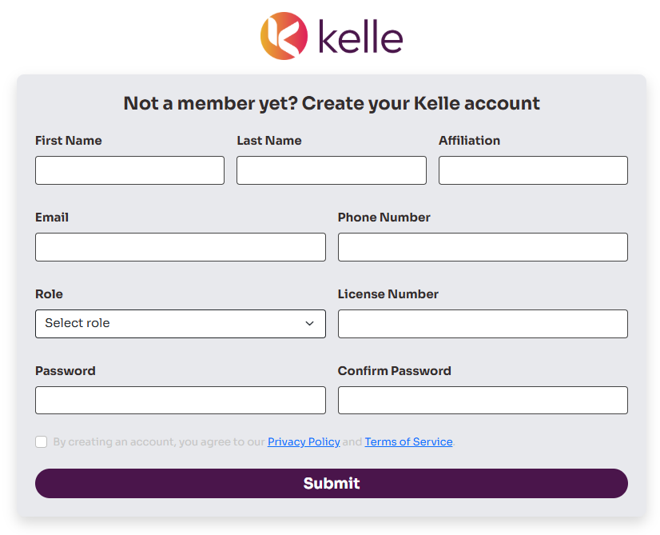
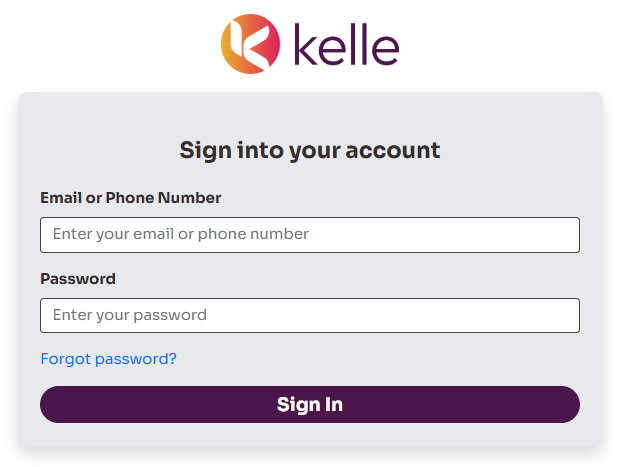
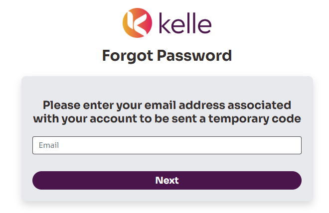
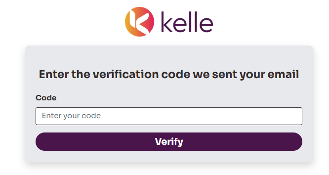
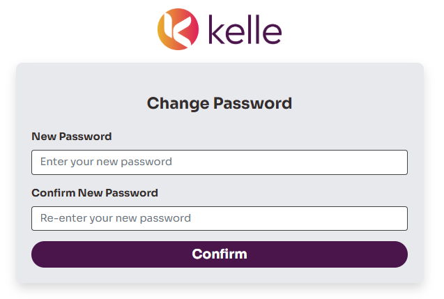
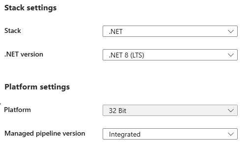
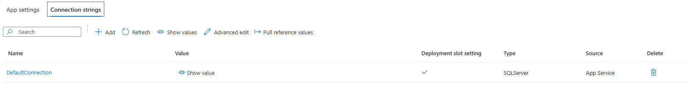

<p align="center">
  

# Kelle Solutions
Kelle Solutions is a simple Razor Pages web application built with ASP.NET Core and Entity Framework Core. Our application demonstrates basic CRUD (Create, Read, Update, Delete) functionality using a database (SQL Server).

## Synopsis
Kelle Solutions is a user-friendly, multi-tenant SaaS (Software as a Service) platform designed to streamline operations for real estate professionals. It provides an all-in-one solution for users to organize and manage their businesses effectively. Each role (agent, tenant, and admin) has tailored views and specific permissions to CRUD (Create, Read, Update, Delete) functionalities. With a scalable design, Kelle Solutions integrates seamlessly with essential tools and systems, allowing users to navigate through their dashboard, leads, properties, listings, entities, and people. While agents have limited access to most functionalities, tenants and admins have additional tools and features, with tenants having advanced permissions.

<table>
  <tr>
    <th><b>Create Account Page</b></th>
    <th><b>Sign In</b></th>
  </tr>
  <tr>
    <td align="center"></td>
    <td align="center"></td>
  </tr>
  <tr>
    <th><b>Forgot Password</b></th>
    <th><b>Verification Code</b></th>
  </tr>
  <tr>
    <td align="center"></td>
    <td align="center"></td>
  </tr>
  <tr>
    <th><b>Change Password</b></th>
    <th><b>Current Dashboard</b></th>
  </tr>
  <tr>
    <td align="center"></td>
    <td align="center"></td>
  </tr>
</table>

<h2>
  <picture>
  <source media="(prefers-color-scheme: dark)" srcset="images/TOCicon.png">
  <source media="(prefers-color-scheme: light)" srcset="images/TOCiconlight.png">
  
  </picture>
  Table of Contents
</h2>

- [Team Scrumbags Members](#team-scrumbags-members)
- [Features](#features)
- [Prerequisites](#prerequisites)
- [Getting Started](#getting-started)
- [Project Structure](#project-structure)
- [Timeline](#timeline)
- [Technologies Used](#technologies-used)
- [Testing](#testing)
- [Deployment](#deployment)
- [Developer Instructions](#instructions)
- [How to Contribute](#contribute)
- [License](#license)

<h2 id="team-scrumbags-members">
  <picture>
  <source media="(prefers-color-scheme: dark)" srcset="images/membersicon.png">
  <source media="(prefers-color-scheme: light)" srcset="images/membersiconlight.png">
  
  </picture>
  Team Scrumbags Members
</h2>

| Members               |
|-----------------------|
| Nancy Zhu             |
| Steven Cao            |
| Brandon Kmiec         |
| Evan Brizendine       |
| Jalen Grant Hall      |
| Kestine Tran [Team Lead]|
| Kyle Mucha            |
| Sergio Rodriguez|

<h2 id="features">
  <picture>
  <source media="(prefers-color-scheme: dark)" srcset="images/features.png">
  <source media="(prefers-color-scheme: light)" srcset="images/featureslight.png">
  
  </picture>
  Features
</h2>

- Razor Pages with ASP.NET Core
- Entity Framework Core for data access
- SQL Server database for persistence
- Dependency Injection for `DbContext`
- CRUD operations for managing student data


<h2 id="prerequisites">
  <picture>
  <source media="(prefers-color-scheme: dark)" srcset="images/prerequisites.png">
  <source media="(prefers-color-scheme: light)" srcset="images/prerequisiteslight.png">
  
  </picture>
  Prerequisites
</h2>

Before running the application, ensure you have the following installed:

- [.NET 6.0 SDK](https://dotnet.microsoft.com/download)
- [SQL Server](https://www.microsoft.com/en-us/sql-server/sql-server-downloads) or [LocalDB](https://docs.microsoft.com/en-us/sql/database-engine/configure-windows/sql-server-2016-express-localdb)
- A text editor or an IDE like [Visual Studio](https://visualstudio.microsoft.com/) or [VS Code](https://code.visualstudio.com/)

<h2 id="getting-started">
  <picture>
  <source media="(prefers-color-scheme: dark)" srcset="images/gettingstarted.png">
  <source media="(prefers-color-scheme: light)" srcset="images/gettingstartedlight.png">
  
  </picture>
  Getting Started
</h2>

Follow these steps to get the application up and running:

### 1. Clone the Repository

```bash
git clone https://github.com/kestra13/kelle-solutions.git
cd kelle-solutions
```

### 2. Restore and Build the Project
```
dotnet tool install --global dotnet-ef
dotnet restore
dotnet build
```

### 3. Install Dependencies (if necessary!)

Install the required NuGet packages if they are not installed:

```bash
dotnet add package Microsoft.AspNetCore.Identity.EntityFrameworkCore
dotnet add package Microsoft.AspNetCore.Identity.UI
dotnet add package Microsoft.EntityFrameworkCore.SqlServer
dotnet add package Microsoft.EntityFrameworkCore.Design
dotnet add package Microsoft.EntityFrameworkCore.Tools
dotnet add package Microsoft.VisualStudio.Web.CodeGeneration.Design
```

### 4. Set Up the Database Connection

Update the `appsettings.json` file with your database connection settings. Here is the recommended setup:

```
{
  "ConnectionStrings": {
    "DefaultConnection": "Server=tcp:kellesolutionssqlserver.database.windows.net,1433;Initial Catalog=KelleSolutionsDB;Persist Security Info=False;User ID=kellesolutionsADMIN;Password=Scrumbags2025!;MultipleActiveResultSets=False;Encrypt=True;TrustServerCertificate=False;Connection Timeout=30;"
  },
  "Logging": {
    "LogLevel": {
      "Default": "Information",
      "Microsoft.AspNetCore": "Warning"
    }
  },
  "AllowedHosts": "*"
}

```

### 5. Apply Migrations and Create the Database

Use Entity Framework Core to apply migrations and create the database schema:

```bash
dotnet ef migrations add InitialCreate
dotnet ef database update
```

### 6. Run the Application

Use the following command to run the application locally:

```bash
dotnet run
```

The application will start on `https://localhost:5072` or `http://localhost:5000`. Upon running the application, the terminal should list the address!


<h2 id="project-structure">
  <picture>
  <source media="(prefers-color-scheme: dark)" srcset="images/structure.png">
  <source media="(prefers-color-scheme: light)" srcset="images/structurelight.png">
  
  </picture>
  Project Structure
</h2>

| **Path**                       | **Description**                                                                                  |
|--------------------------------|--------------------------------------------------------------------------------------------------|
| `Pages/Affiliations`           | Razor Pages for reading, updating, and deleting a User's company or organization affiliation.    |
| `Pages/Entities`               | Razor Pages for creating, reading, updating, and deleting entities, which represent companies and organizations. |
| `Pages/Leads`                  | Razor Pages for creating, reading, updating, and deleting leads, which are potential tenants or clients. |
| `Pages/Listings`               | Razor Pages for creating, reading, updating, and deleting property listings, which are advertisements for houses. |
| `Pages/People`                 | Razor Pages for creating, reading, updating, and deleting tenants, or clients.                  |
| `Pages/Properties`             | Razor Pages for creating, reading, updating, and deleting properties.                           |
| `Pages/Roles`                  | Razor Pages for reading table of User roles.                                                    |
| `Pages/Shared`                 | Razor Pages for general UI/UX layout and login recognition.                                     |
| `Pages/Transactions`           | Razor Pages for documenting transactions.                                                       |
| `Models/Affiliate.cs`          | The `Affiliate` entity class, representing an agent's company or organization.                  |
| `Models/Person.cs`             | The `Person` entity class, representing tenants, or clients.                                    |
| `Models/RealEstateProperty.cs` | The `RealEstateProperty` entity class, representing a property.                                 |
| `Models/User.cs`               | The `User` entity class, representing any agent, tenant, or admin who logs in.                  |
| `Data/KelleSolutionsDbContext.cs` | The database context class for managing the database connection and querying the `Properties` and `Affiliates` model. |

<h2 id="technologies-used">
  <picture>
  <source media="(prefers-color-scheme: dark)" srcset="images/technologiesused.png">
  <source media="(prefers-color-scheme: light)" srcset="images/technologiesusedlight.png">
  
  </picture>
  Technologies Used
</h2>

- ASP.NET Core Razor Pages
- Entity Framework Core
- SQL Server / LocalDB (In development)
- Azure SQL Server Hosting (In testing)
- Bootstrap (for simple page styling)

<h2 id="testing">
  <picture>
  <source media="(prefers-color-scheme: dark)" srcset="images/testing.png">
  <source media="(prefers-color-scheme: light)" srcset="images/testinglight.png">
  
  </picture>
  Testing
</h2>

This section will include:
- Unit testing for critical functionalities (e.g. CRUD operations).
- Integration testing for database and authentication flows.
- Load testing to ensure application performance under concurrent usage.
- User acceptance testing to verify role-based dashboards and features.

<h2 id="deployment">
  <picture>
  <source media="(prefers-color-scheme: dark)" srcset="images/deploy.png">
  <source media="(prefers-color-scheme: light)" srcset="images/deploylight.png">
  
  </picture>
  Deploy
</h2>

This section outlines how to publish the **KelleSolutions** web application to **Azure App Services** and automate deployment using **GitHub Actions**.

---

### 1. Publish to Azure

#### 1.1. Create Resources

##### 1.1.1. Azure App Service

- Go to the Azure Portal and create an App Service.
- Navigate to the **Configuration** settings within your App Service for **KelleSolutions**.
- Under **Stack settings**, select:
  - **Stack**: `.NET`
  - **.NET Version**: `.NET 8 (LTS)`
- Under **Platform settings**, set:
  - **Platform**: `32 Bit`
  - **Managed pipeline version**: `Integrated`
- Under **Platform settings**, set:
  - **Platform**: `32 Bit`
  - **Managed pipeline version**: `Integrated`

<p>
  
</p>


##### 1.1.2. Azure SQL Database

- Create an **Azure SQL Database** named `KelleSolutionsDB`.
- Under **Networking > Firewall Rules**, add a rule to allow the App Service’s IP address to access the database.

---

### 2. Set Configuration

#### 2.1. Add Environment Variables

- In the Azure Portal, navigate to:
- Add a new **Connection String**:
- **Name**: `DefaultConnection`
- **Value**: the ADO.NET connection string found in your SQL Database panel (under the "Connection Strings" tab).
- **Type**: SQLServer
<p>
  
</p>

> ⚠️ Ensure that this matches the connection string exactly as shown in the Azure SQL Database blade.

---

### 3. Deploy

#### 3.1. GitHub Actions (CI/CD Pipeline)

To automate deployment on every push to `main`, set up a GitHub Actions workflow:

##### 3.1.1. Create Workflow File

- Add a `.yml` file with the code below, the file could be named kellesolutionsdeploy.yml:
```
name: Build and deploy ASP.Net Core app to Azure Web App - kellesolutions

on:
  push:
    branches:
      - main
  workflow_dispatch:

jobs:
  build:
    runs-on: windows-latest
    permissions:
      contents: read

    steps:
      - name: Checkout code
        uses: actions/checkout@v4

      - name: Set up .NET Core
        uses: actions/setup-dotnet@v4
        with:
          dotnet-version: '8.x'

      - name: Build with dotnet
        run: dotnet build ./KelleSolutions/KelleSolutions.sln --configuration Release

      - name: dotnet publish
        run: dotnet publish ./KelleSolutions/KelleSolutions.sln --configuration Release --output ./publish_output

      - name: Upload artifact for deployment job
        uses: actions/upload-artifact@v4
        with:
          name: .net-app
          path: ./publish_output

  deploy:
    runs-on: windows-latest
    needs: build
    environment:
      name: 'Production'
      url: ${{ steps.deploy-to-webapp.outputs.webapp-url }}
    permissions:
      id-token: write
      contents: read

    steps:
      - name: Download artifact from build job
        uses: actions/download-artifact@v4
        with:
          name: .net-app
          path: ./publish_output

      - name: Login to Azure
        uses: azure/login@v2
        with:
          client-id: ${{ secrets.AZUREAPPSERVICE_CLIENTID_8BE90CCCB08A4CA1AD1AC05FB53DED2B }}
          tenant-id: ${{ secrets.AZUREAPPSERVICE_TENANTID_A42E269D49294F589C27F30AFB84CBDE }}
          subscription-id: ${{ secrets.AZUREAPPSERVICE_SUBSCRIPTIONID_29C588753C9E4743AC39A72AC415C554 }}

      - name: Deploy to Azure Web App
        id: deploy-to-webapp
        uses: azure/webapps-deploy@v3
        with:
          app-name: 'kellesolutions'
          slot-name: 'Production'
          package: ./publish_output
```


<h2 id="instructions">
  <picture>
  <source media="(prefers-color-scheme: dark)" srcset="images/instructions.png">
  <source media="(prefers-color-scheme: light)" srcset="images/instructionslight.png">
  
  </picture>
  Developer Instructions
</h2>

1. Prepare changes to be staged
```bash
git add .
```
2. Commit your changes
```bash
git commit -m 'Add my feature'
```
3. Push to the branch
```bash
git push origin main
```
4. Create a new Pull Request
```bash
git pull origin main
```

<h2 id="contribute">
  <picture>
  <source media="(prefers-color-scheme: dark)" srcset="images/contribute.png">
  <source media="(prefers-color-scheme: light)" srcset="images/contributelight.png">
  
  </picture>
  How to Contribute
</h2>

If you'd like to contribute to the project:

1. Fork the repository (through GitHub)
2. Create a feature branch
```bash
git checkout -b feature/my-feature
```
3. Commit your changes
```bash
git commit -m 'Add my feature'
```
4. Push to the branch
```bash
git push origin feature/my-feature
```
5. Create a new Pull Request
```bash
git pull origin main
```

<h2 id="license">
  <picture>
  <source media="(prefers-color-scheme: dark)" srcset="images/license.png">
  <source media="(prefers-color-scheme: light)" srcset="images/licenselight.png">
  
  </picture>
  License
</h2>

All rights are observed. This project is not open source.
